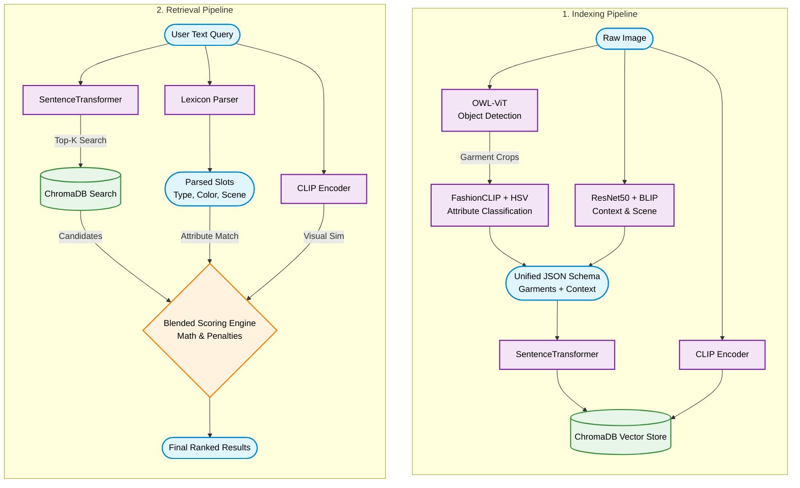

# Multimodal Fashion & Context Retrieval Engine

## Overview

This repository contains a Multimodal Fashion Retrieval Engine designed to allow users to search a database of fashion imagery using complex natural language queries. The system bridges the semantic gap between unstructured textual intent and visual data by employing a hybrid "Detect-then-Classify" architecture. 

It does not rely on simple, monolithic embeddings that struggle with compositionality (e.g., confusing a "red shirt and blue pants" with a "blue shirt and red pants"). Instead, it explicitly detects individual garments, verifies their localized attributes (color, pattern, material), and assesses the global context of the image (scene, style, activity).

---

## Architecture Flow

The following diagram illustrates how raw images and user text queries are processed and mathematically compared.



---

## Core Models & Technology Stack

The pipeline orchestrates several specialized machine learning models to maximize accuracy and compositionality:

- **Object Detection (OWL-ViT):** `google/owlvit-base-patch32` handles zero-shot bounding box detection to isolate specific garments.
- **Attribute Classification (FashionCLIP):** `patrickjohncyh/fashion-clip` performs zero-shot classification on the bounding box crops to identify fine-grained garment patterns and types.
- **Color Verification (OpenCV/NumPy):** To prevent VLM color hallucination, the physical bounding box crop undergoes deterministic HSV histogram analysis to forcefully verify and override predicted colors.
- **Scene Recognition (ResNet50):** `Places365` identifies the environmental background (e.g., park, office, street).
- **Captioning & Activity (BLIP):** `Salesforce/blip-image-captioning-large` generates a global caption, which is parsed by custom NLP lexicons to extract the subject's activity (e.g., sitting, walking) and material types (e.g., leather, denim).
- **Text & Image Embeddings:** `sentence-transformers/all-MiniLM-L6-v2` for dense text matching, and standard OpenAI CLIP for text-to-image similarity matching.
- **Database & UI:** `ChromaDB` handles persistent vector storage, while `Streamlit` powers the interactive user interface.

---

## Ranking & Scoring Strategy

The retrieval engine uses a mathematical **Blended Scoring Function** to rank candidate images. The final score is a weighted sum of four distinct components:

```text
Final Score = (α * EmbeddingScore) + (β * AttributeScore) + (γ * ImageScore) + (δ * EnvironmentScore)
```

### 1. Attribute Score (Confidence-Aware)
Parsed query slots (e.g., `[type: jacket, material: leather, color: black]`) are explicitly matched against the detected JSON schema in the database.
- Base points are awarded for matching type, color, material, and pattern.
- Severe negative points are applied for contradicting colors or patterns.
- **Confidence Scaling:** The resulting match score is multiplied by the AI's original detection confidence score, prioritizing garments the AI is highly certain about.

### 2. Environment Score (Contradiction Penalties)
Matches the query's requested scene, style, and activity against the image's global metadata.
- If the user explicitly requests an environment (e.g., "office") and the image clearly depicts a contradiction (e.g., "park"), the system applies a strict **-0.3 mathematical penalty**, ensuring garment-only matches do not outrank contextually correct images.

### 3. Dense Embedding Score
The mathematical cosine similarity between the user's raw text query and the dense JSON-derived sentence stored in ChromaDB.

### 4. CLIP Image Score
The cosine similarity between the user's raw text query (encoded via CLIP text encoder) and the raw candidate image (encoded via CLIP image encoder).

---

## Setup & Installation Guide

### Prerequisites
- Python 3.9+
- A valid HuggingFace API Token

### 1. Clone & Environment Setup
Clone the repository and install the dependencies:
```bash
git clone https://github.com/yourusername/fashion_retrieval.git
cd fashion_retrieval
pip install -r requirements.txt
```
*(Ensure `torch`, `torchvision`, `transformers`, `chromadb`, and `streamlit` are installed).*

### 2. Configure API Keys
The system relies on the HuggingFace Inference API for captioning and dataset downloading. Export your token to your environment variables:

**Windows (PowerShell):**
```powershell
$env:HF_API_KEY="your_huggingface_token_here"
```
**Mac/Linux:**
```bash
export HF_API_KEY="your_huggingface_token_here"
```

### 3. Build the Index
To ingest new images or build the database from scratch, run the indexing script. This script will download the images, run them through the detection pipeline, and persist the vector data to `data/chroma_db`.
```bash
python -m indexer.build_index
```
*Note: The script is designed to be idempotent. It will safely skip already-indexed images.*

### 4. Launch the Application
Start the interactive Streamlit user interface to begin querying your database.
```bash
streamlit run app.py
```
Open the provided `localhost` URL in your browser to view the application, explore search results, and inspect the granular score breakdowns.
